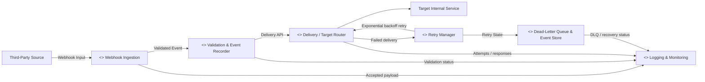

# Lab 3 – UML Component Diagram

**Project:** Webhook Ingestion & Retry Mechanism Hub  
**SRN:** PES1UG24AM201  
**Name:** Prathyush Gowda

The component model below applies the Lab 3 component-modelling requirements to the existing webhook project. It identifies more than five components and shows the main interfaces/dependencies for ingestion, validation, delivery, retry, persistence, and logging.

**UML source:** `Lab3_Component_Diagram.puml`
